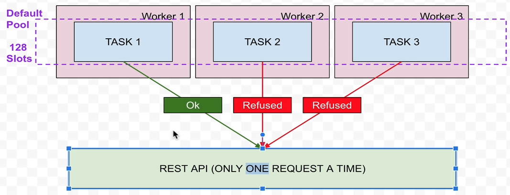
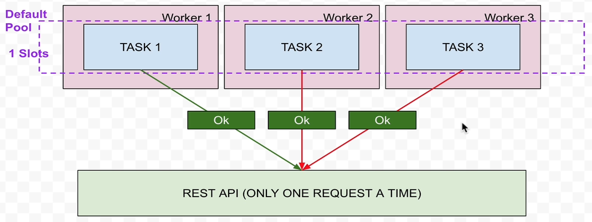

# Pools and priority_weights
## Pools
- To limit the number of concurrent instances of a specific type of task in order to avoid overwhelming the source or destination
- For example, let's say you have three worker nodes, where in total three tasks can be executed in parallel
- Now in your DAG, you have three tasks to pull data from a REST API in parallel but this API can be requested only once at a time



- But how can we limit the number of requests down to 1 without having to modify the parameters of Airflow cluster?
- Pools can help in this
- By using pools, we can limit the number of tasks requesting the API by defining a number of slots, which is 1 in our case and assign the three tasks to this pool
- By this all the tasks will execute sequentially one after the other

- Start Airflow
```
docker ps
docker-compose -f docker-compose-CeleryExecutor.yml up -d --scale worker=3
docker ps
```

- Open pool_dag.py and review the code
- Create connections in Airflow UI Admin
  - Conn Id: forex_api
  - Conn Type: HTTP
  - Host: api.exchangeratesapi.io
- Open Airflow UI and enable the DAG
- Refresh page and open the DAG -> Gantt
- Notice that 3 tasks are executed in parallal
- We can limit it to run only 1 task at a time using pools
- Open Admin -> Pools -> Create
  - pool name: forex_api_pool
  - slots: 1
- default_pool is used by all our tasks by default
- Now we will limit our tasks to use forex_api_pool pool
- Open pool_dag.py and review the code
- Add the parameter - pool="forex_api_pool"
- Now trigger the DAG again
- Notice that only 1 task is executed at a time

## Priority_weights
- To prioritize the tasks
- We can add a parameter to the operator to prioritize - priority_weight
- By default priority_weight = 1
- We can change this to any number to change the order in which tasks will be executed under the pool
- Open pool_dag.py and specify priority_weight values in each task
- Now run the DAG
- Notice in which order tasks are executed
- Stop Airflow Cluster
```
docker-compose -f docker-compose-CeleryExecutor.yml down
```
